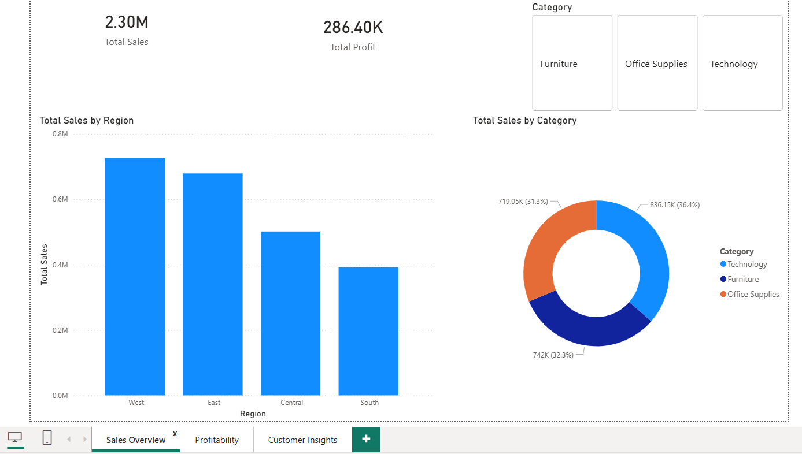
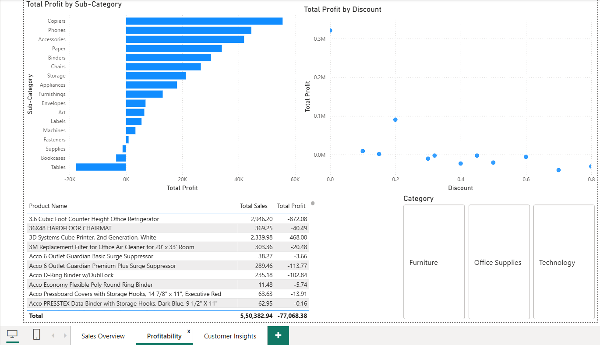
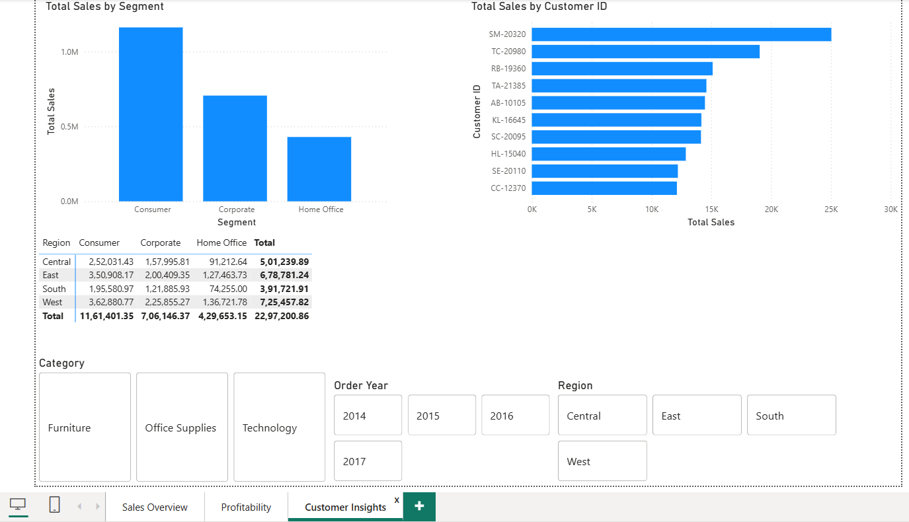

🔹 Project Title

Superstore Sales Analysis & Dashboard

🔹 Objective

Analyze retail sales data to identify revenue drivers, loss-making areas, and customer behavior to support business decision-making.

🔹 Dataset

Sample Superstore Dataset (Kaggle)

~10,000 retail transactions

Key fields: Sales, Profit, Discount, Category, Region, Segment, Dates

🔹 Tools & Technologies

Python (Pandas, NumPy, Matplotlib, Seaborn)

Jupyter Notebook

Power BI

Git & GitHub

🔹 Key Business Questions Answered

Which regions and categories drive the highest sales and profit?

Which products generate high revenue but low or negative profit?

How do discounts affect profitability?

Which customer segments contribute the most value?

🔹 Key Insights

Technology category generates the highest overall profit.

High discount levels significantly reduce profit margins.

Some sub-categories show strong sales but consistent losses.

Corporate and Consumer segments contribute most revenue.

🔹 Business Recommendations

Optimize discount strategy for loss-making products.

Focus marketing on high-margin categories and segments.

Re-evaluate pricing or sourcing for consistently unprofitable sub-categories.

🔹 Dashboard Preview

(Add screenshots of your Power BI dashboard here)

🔹 Project Structure
superstore-sales-analysis/
├── data/
├── notebooks/
├── dashboard/
├── README.md
└── requirements.txt

🔹 Power BI Dashboard

### Sales Overview

### Profitability Analysis

### Customer Insights

